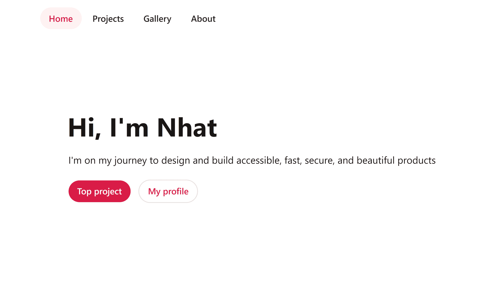

# imnhatnguyen.com



## Running locally

```bash
git clone https://github.com/imnhatnguyen/imnhatnguyen.com.git
cd imnhatnguyen.com
yarn install
yarn dev
```

## Acknowledgement

This repository was developed based on the amazing work of these authors:

- Theodorus Clarence

  - [ts-nextjs-tailwind-starter](https://github.com/theodorusclarence/ts-nextjs-tailwind-starter) provided me with a convenient development environment
  - [theodorusclarence.com](https://github.com/theodorusclarence/theodorusclarence.com) gave me a beautiful UI baseline

- Lee Robinson
  - [leerob.io](https://github.com/leerob/leerob.io) guided me through how to use Contentlayer
